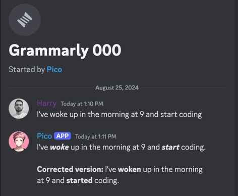

# Discord Bot

To install dependencies:

```bash
bun install
```

To run:

```bash
bun run dev
```

This project was created using `bun init` in bun v1.1.24. [Bun](https://bun.sh) is a fast all-in-one JavaScript runtime.

## Strategies/Templates

### Grammarly Bot

It has typo checking capabilities. It leverages the [GPT-4o-mini](https://openai.com) model to provide suggestions for
typos in the messages sent by users.

Just add an emoji 'Open book' to your message and the bot will respond with suggestions for typos.

<details>
<summary>Example</summary>


</details>

### TechBro Bot

It has the ability to provide information about the latest technologies. It can be called by mentioning the bot name and
asking any technology-related questions.

<details>
<summary>Example</summary>


</details>

### Clarify Bot

It will explain things either text-based or visual attachments. It can be called by reacting (thinking face) to the message.


## Dependencies

- [Javascript Bun runtime](https://bun.sh)
- [Discord bot account](https://discord.com/developers/applications)
- [OpenAI API key](https://openai.com) (With GPT-4o-mini model enabled)


## Commands

